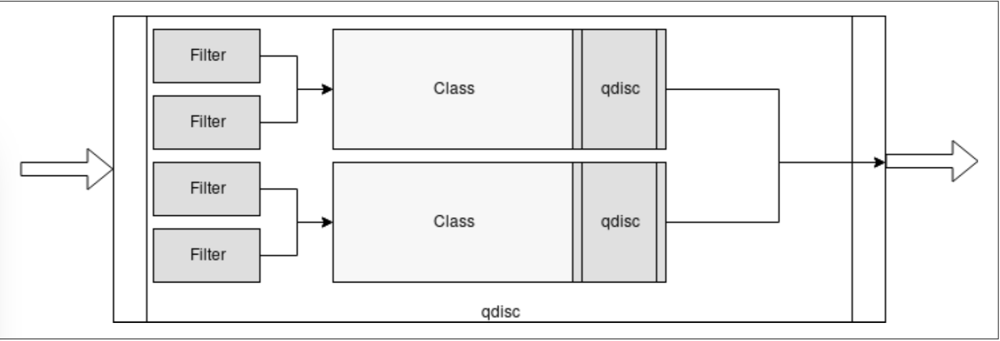
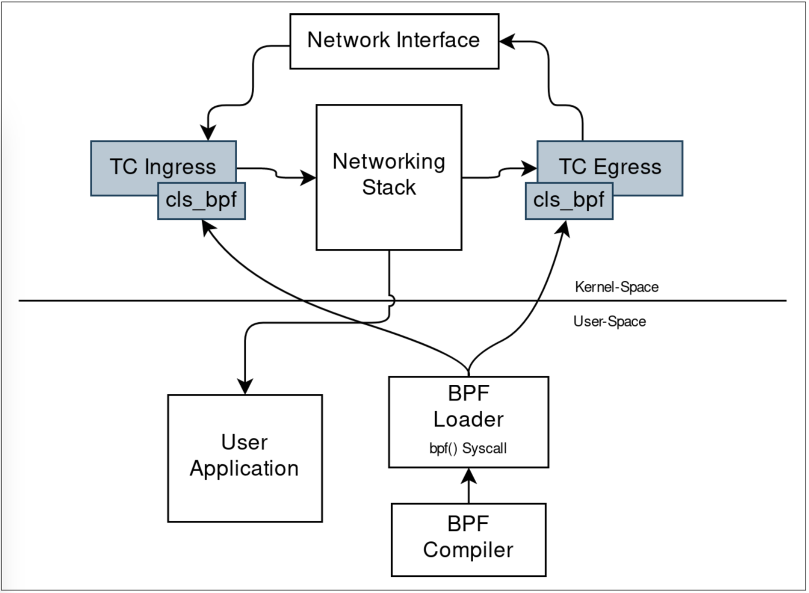

从网络的角度来看，BPF程序有两个使用场景：数据包捕获和过滤。

这意味着用户态程序可以将过滤器附加到任何套接字，并从数据包提取信息，并允许/禁止/重定向某些种类的数据包。

本章的目的是说明BPF程序如何在Linux内核网络栈中网络数据路径的不同阶段与 Socket Buffer 数据结构进行交互。 我们将介绍两种常见类型的程序：

- 与sockets相关的程序类型。

- 基于BPF分类器实现流量控制的程序类型。

*Socket Buffer 结构（也称为SKB或sk_buff）在内核中用来处理每个发送或接收的数据包。通过阅读SKB，您可以传递或丢弃数据包并填充BPF映射，以创建有关当前流量的统计信息和流量度量。*

*另外，一些BPF程序允许您操作SKB，并通过扩展对最终数据包进行转换，以重定向它们或更改其基本结构。 例如，在仅IPv6的系统上，您可以编写一个程序，将所有接收到的数据包从IPv4转换为IPv6，这可以通过处理数据包的SKB来完成。*

理解我们编写的各种程序之间的差异以及不同的程序如何导致相同的结果是理解BPF的关键。在下一节中，我们将探讨在套接字级别进行过滤的两种方法：使用经典BPF筛选器，以及使用附加到套接字的eBPF程序。

### BPF 和包过滤

如前所述，在网络方面，BPF过滤器和eBPF程序是BPF程序的两个主要的使用场景；但是，最初BPF程序是数据包过滤的同义词。

数据包过滤仍然是最重要的场景之一，并已在Linux 3.19中从经典BPF（cBPF）扩展到现代eBPF，并在过滤程序类型BPF_PROG_TYPE_SOCKET_FILTER 中添加了与映射相关的功能。

过滤器主要可用于三种高级方案：

- 实时丢弃流量（例如，仅允许用户数据报协议[UDP]流量并丢弃其他任何内容）。

- 实时观察流入实时系统的一组经过过滤的数据包。

- 使用pcap格式，重放和分析实时系统中捕获的网络流量。

*术语pcap来自两个词的结合：数据包和捕获。 pcap格式被实现为特定域的API，用于在数据包捕获库（libpcap）的库中捕获数据包。当您要将在实时系统上捕获的一组数据包直接保存到文件中，以便以后使用一种可以读取以pcap格式导出的数据包流的工具将其分析时，此格式在调试场景中很有用。*

在以下各节中，我们展示两种不同的方法来应用BPF程序进行数据包过滤的概念。首先，我们展示如何使用通用且广泛使用的工具（如tcpdump）充当用作过滤器的BPF程序的高级接口。然后，我们继续使用BPF程序类型 BPF_PROG_TYPE_SOCKET_FILTER 编写和加载自己的程序。

#### tcpdump 和 BPF表达式

在谈论实时流量分析和观察时，几乎每个人都知道的命令行工具之一是tcpdump。本质上是libp cap的前端，它允许用户定义高级过滤表达式。 tcpdump的作用是从您选择的网络接口（或任何接口）读取数据包，然后将接收到的数据包的内容写入stdout或文件。数据包流可以使用pcap过滤器语法进行过滤。 pcap过滤器语法是一种DSL，用于通过一组表达式组成的高级表达式来过滤数据包，这些表达式通常比BPF汇编更容易记住。由于整个集合都可以在man 7 pcap-filter中找到，因此无法解释pcap过滤器语法中所有可能的原语和表达式，因此不在本章的讨论范围之内，但是我们通过一些示例使您可以理解其功能。

场景是，我们在一个Linux盒子中，该盒子在端口8080上公开了一个Web服务器。该Web服务器未记录接收到的请求，我们真的想知道它是否正在接收任何请求，以及这些请求如何流入其中，因为所提供的应用程序的客户抱怨浏览时无法获得任何响应产品页面。在这一点上，我们仅知道客户正在使用该Web服务器提供的Web应用程序连接到我们的产品页面之一，而且几乎总是发生这种情况，我们不知道是什么原因造成的，因为最终用户通常，不会尝试为您调试服务，很遗憾，我们没有在该系统中部署任何日志记录或错误报告策略，因此在调查问题时我们完全是盲目的。幸运的是，有一种工具可以帮助我们！它是tcpdump，可以告诉它仅过滤在系统中使用端口8080上的传输控制协议（TCP）的IPv4数据包。因此，我们将能够分析Web服务器的流量并了解什么是网络流量。错误的请求。

这是使用tcpdump进行过滤的命令：

```sh
    # tcpdump -n 'ip and tcp port 8080'
```

让我们看看这个命令发生了什么：

- -n 告诉tcpdump不要将地址转换为相应的名称，我们想查看源地址和目标地址。

- ip和tcp端口8080是tcpdump将用于过滤数据包的pcap过滤器表达式。 ip表示IPv4，是表示更复杂的过滤器的结合体，可以添加更多表达式以进行匹配，然后我们指定仅对使用tcp端口8080来自或到达端口8080的TCP数据包感兴趣。最好的过滤器应该是tcp dst端口8080，因为我们只对将8080作为目标端口的数据包感兴趣，而对来自它的数据包不感兴趣。

输出将是这样的（没有多余的部分，例如完整的TCP握手）：

```sh
    tcpdump: verbose output suppressed, use -v or -vv for full protocol decode
        listening on wlp4s0, link-type EN10MB (Ethernet), capture size 262144 bytes
        12:04:29.593703 IP 192.168.1.249.44206 > 192.168.1.63.8080: Flags [P.],
        seq 1:325, ack 1, win 343,
        options [nop,nop,TS val 25580829 ecr 595195678],
    
    length 324: HTTP: GET / HTTP/1.1
        12:04:29.596073 IP 192.168.1.63.8080 > 192.168.1.249.44206: Flags [.],
        seq 1:1449, ack 325, win 507,
        options [nop,nop,TS val 595195731 ecr 25580829],
        length 1448: HTTP: HTTP/1.1 200 OK
        12:04:29.596139 IP 192.168.1.63.8080 > 192.168.1.249.44206: Flags [P.],
        seq 1449:2390, ack 325, win 507,
        options [nop,nop,TS val 595195731 ecr 25580829],
        length 941: HTTP
        12:04:46.242924 IP 192.168.1.249.44206 > 192.168.1.63.8080: Flags [P.],
        seq 660:996, ack 4779, win 388,
        options [nop,nop,TS val 25584934 ecr 595204802],
        length 336: HTTP: GET /api/products HTTP/1.1
        12:04:46.243594 IP 192.168.1.63.8080 > 192.168.1.249.44206: Flags [P.],
        seq 4779:4873, ack 996, win 503,
        options [nop,nop,TS val 595212378 ecr 25584934],
        length 94: HTTP: HTTP/1.1 500 Internal Server Error
        12:04:46.329245 IP 192.168.1.249.44234 > 192.168.1.63.8080: Flags [P.],
        seq 471:706, ack 4779, win 388,
        options [nop,nop,TS val 25585013 ecr 595205622],
        length 235: HTTP: GET /favicon.ico HTTP/1.1
        12:04:46.331659 IP 192.168.1.63.8080 > 192.168.1.249.44234: Flags [.],
        seq 4779:6227, ack 706, win 506,
        options [nop,nop,TS val 595212466 ecr 25585013],
        length 1448: HTTP: HTTP/1.1 200 OK
        12:04:46.331739 IP 192.168.1.63.8080 > 192.168.1.249.44234: Flags [P.],
        seq 6227:7168, ack 706, win 506,
        options [nop,nop,TS val 595212466 ecr 25585013],
        length 941: HTTP
```

现在情况已经清楚得多了！我们有一堆请求进展顺利，返回了200 OK状态代码，但在 /api/products 端点上还有一个带有500 Internal Server Error代码的请求。我们的客户是对的；我们在列出产品时遇到了问题！

此时，您可能会问自己，这些pcap过滤内容和tcpdump具有自己的语法，那么它们与BPF程序有什么关系？ Linux上的Pcap过滤器已编译为BPF程序！而且由于tcpdump使用pcap过滤器进行过滤，这意味着每次使用过滤器执行tcpdump时，实际上是在编译和加载BPF程序来过滤数据包。幸运的是，通过将-d标志传递给tcpdump，可以转储在使用指定过滤器时将加载的BPF指令：

```sh
    tcpdump  -d  'ip and tcp port 8080'
```

该过滤器与上一个示例中使用的过滤器相同，但是由于带有-d标志，因此现在的输出是一组BPF汇编指令。

具体输出如下：

```sh
    (000) ldh      [12]
    (001) jeq      #0x800
    (002) ldb      [23]
    (003) jeq      #0x6
    (004) ldh      [20]
    (005) jset     #0x1fff
    (006) ldxb     4*([14]&0xf)
    (007) ldh      [x + 14]
    (008) jeq      #0x1f90
    (009) ldh      [x + 16]
    (010) jeq      #0x1f90
    (011) ret      #262144
    (012) ret      #0
```

让我们分析一下它：

ldh [12]

（ld）从累加器的偏移量为12的位置开始加载16位（即以太类型字段），如图6-1所示。

jeq #0x800 jt 2 jf 12

（j）如果（eq）相等，则跳转；检查上一条指令的Ethertype值是否等于0x800（这是IPv4的标识符），如果为true（jt），则跳转到2；如果为false（jf），则跳转到12。如果Internet协议是IPv4将继续执行下一个指令，否则它将跳转到末尾并返回零。

ldb [23]

将字节加载到（ldb）中，将从IP帧加载更高层的协议字段，该字段位于偏移23处--偏移23来自以太网第2层帧中标头的14个字节（请参见图6-1）和协议在IPv4标头中的位置，即第9位，因此14 + 9 = 23。

jeq #0x6 jt 4 jf 12

如果相等，则再次跳跃。在这种情况下，我们检查先前提取的协议为0x6，即TCP。如果是，则跳至下一条指令（4），或者转到末尾（12）——如果不是，则丢弃该数据包。

ldh [20]

这是另一条加载半字指令——在这种情况下，它是从IPv4标头加载数据包偏移量+片段偏移量的值。

jset #0x1fff jt 12 6

如果我们在片段偏移量中找到的任何数据为true，则此jset指令将跳至12；否则，跳至6，这是下一条指令。指令0x1fff之后的偏移量告诉jset指令仅查看数据的最后13个字节。 （展开后变为0001 1111 11111111。）

ldxb 4*([14]&0xf)

（ld）将x（b）装入x（x）。该指令会将IP标头长度的值加载到x中。


ldh [x + 14]

另一个加载半字指令将获得偏移量（x + 14）的值，即IP报头长度+ 14，这是数据包中源端口的位置。

jeq #0x1f90 jt 11 jf 9

如果（x + 14）处的值等于0x1f90（十进制为8080），这意味着源端口将为8080，继续到11或通过继续到9（如果为false）来检查目标端口是否在端口8080上。

ldh [x + 16]

这是另一个加载半字指令，它将获取偏移量（x + 16）的值，该值是数据包中目标端口的位置。

jeq #0x1f90 jt 11 jf 12

这是另一个相等的跳转，这次用于检查目的地是否为8080，转到11；如果不是，请执行12，丢弃该报文。

ret #262144

到达此指令后，将找到一个匹配项，从而返回匹配的捕捉长度。默认情况下，此值为262,144字节。可以使用tcpdump中的-s参数对其进行调整。


这是“正确的”示例，因为正如我们在Web服务器中所说的那样，我们只需要考虑将8080作为目标而不是作为源的数据包，因此tcpdump过滤器可以将其指定为dst目标领域：

```sh
    tcpdump -d 'ip and tcp dst port 8080'
```

在这种情况下，转储的指令集与前面的示例相似，但是如您所见，它缺少将数据包与端口8080的源进行匹配的全部内容。实际上，没有ldh [x + 14]和相对jeq＃0x1f90 jt 11 jf 9。

```sh
    (000) ldh      [12]
    (001) jeq      #0x800           jt 2    jf 10
    (002) ldb      [23]
    (003) jeq      #0x6             jt 4   jf 10
    (004) ldh      [20]
    (005) jset     #0x1fff          jt 10   jf 6
    (006) ldxb     4*([14]&0xf)
    (007) ldh      [x + 16]
    (008) jeq      #0x1f90          jt 9   jf 10
    (009) ret      #262144
    (010) ret      #0
```

除了像我们分析tcpdump生成的程序集外，您可能还想编写自己的代码来过滤网络数据包。事实证明，在这种情况下，最大的挑战是实际调试代码的执行以确保其符合我们的期望。在这种情况下，内核源代码树中的 tools/bpf 中有一个名为bpf_dbg.c的工具，它实际上是一个调试器，可让您加载程序和pcap文件来逐步测试执行情况。

*tcpdump也可以直接从.pcap文件读取并对其应用BPF过滤器。*

#### 原始套接字的数据包筛选（BPF_PROG_TYPE_SOCKET_FILTER）

BPF_PROG_TYPE_SOCKET_FILTER程序类型允许您将BPF程序附加到套接字。它接收到的所有数据包都将以sk_buff结构的形式传递给程序，然后程序可以决定是否丢弃或允许它们。这种程序还具有访问和处理映射的能力。

让我们看一个示例，看看如何使用这种BPF程序。

我们的示例程序的目的是计算观察到的接口中流动的TCP，UDP和Internet控制消息协议（ICMP）数据包的数量。为此，我们需要以下内容：

- 可以查看数据包流向的BPF程序。

- 用于加载程序并将其附加到网络接口的代码。

- 用于编译程序并启动加载程序的脚本。

此时，我们可以用两种方式编写BPF程序：作为C代码，然后将其编译到ELF文件中，或直接作为BPF程序集。在此示例中，我们选择使用C代码来显示更高级别的抽象以及如何使用Clang编译程序。请务必注意，要制作此程序，我们使用的标头和帮助程序仅在Linux内核的源代码树中可用，因此首先要做的是使用Git获得它的副本。为避免差异，您可以签出我们用来制作此示例的相同提交SHA：

```sh
    export KERNEL_SRCTREE=/tmp/linux-stable
    git clone  git://git.kernel.org/pub/scm/linux/kernel/git/stable/linux-stable.git
      $KERNEL_SRCTREE
    cd $KERNEL_SRCTREE
    git checkout 4b3c31c8d4dda4d70f3f24a165f3be99499e0328
```

*要包含BPF支持，您将需要clang> = 3.4.0和llvm> = 3.7.1。要在安装中验证对BPF的支持，可以使用命令llc -version查看是否具有BPF目标。*

现在您已经了解了套接字过滤，现在我们可以开始使用socket类型的BPF程序。

##### BPF 程序

BPF程序的主要职责是访问它收到的数据包。检查其协议是TCP，UDP还是ICMP，然后在找到的协议的特定键上的映射数组上增加计数器。

对于此程序，我们将利用加载机制，该机制使用位于内核源代码树的 samples/bpf/bpf_load.c 中的帮助程序来解析ELF文件。加载功能 load_bpf_file 能够识别某些特定的ELF section头 并将其与相应的程序类型相关联。该代码的外观如下：

```c
    bool is_socket = strncmp(event, "socket", 6) == 0;
    bool is_kprobe = strncmp(event, "kprobe/", 7) == 0;
    bool is_kretprobe = strncmp(event, "kretprobe/", 10) == 0;
    bool is_tracepoint = strncmp(event, "tracepoint/", 11) == 0;
    bool is_raw_tracepoint = strncmp(event, "raw_tracepoint/", 15) == 0; 
    bool is_xdp = strncmp(event, "xdp", 3) == 0;
    bool is_perf_event = strncmp(event, "perf_event", 10) == 0;
    bool is_cgroup_skb = strncmp(event, "cgroup/skb", 10) == 0;
    bool is_cgroup_sk = strncmp(event, "cgroup/sock", 11) == 0;
    bool is_sockops = strncmp(event, "sockops", 7) == 0;
    bool is_sk_skb = strncmp(event, "sk_skb", 6) == 0;
    bool is_sk_msg = strncmp(event, "sk_msg", 6) == 0;

```

代码要做的第一件事是在section 头和内部变量之间创建关联-就像SEC（“ socket”）一样，我们将以bool is_socket = true结尾。

在同一文件的后面，我们看到一组if指令，这些指令在标题和实际prog_type之间创建关联，因此对于is_socket，我们以BPF_PROG_TYPE_SOCKET_FILTER结尾：

```c
    if (is_socket) {
        prog_type = BPF_PROG_TYPE_SOCKET_FILTER;
    } else if (is_kprobe || is_kretprobe) { 
        prog_type =     BPF_PROG_TYPE_KPROBE;
    } else if (is_tracepoint) {
        prog_type = BPF_PROG_TYPE_TRACEPOINT;
    } else if (is_raw_tracepoint) {
        prog_type = BPF_PROG_TYPE_RAW_TRACEPOINT;
    } else if (is_xdp) {
        prog_type = BPF_PROG_TYPE_XDP;
    } else if (is_perf_event) {
        prog_type = BPF_PROG_TYPE_PERF_EVENT;
    } else if (is_cgroup_skb) {
        prog_type = BPF_PROG_TYPE_CGROUP_SKB;
    } else if (is_cgroup_sk) {
        prog_type = BPF_PROG_TYPE_CGROUP_SOCK;
    } else if (is_sockops) {
        prog_type = BPF_PROG_TYPE_SOCK_OPS;
    } else if (is_sk_skb) {
        prog_type = BPF_PROG_TYPE_SK_SKB;
    } else if (is_sk_msg) {
        prog_type = BPF_PROG_TYPE_SK_MSG;
    }else{
        printf("Unknown event '%s'\n", event); return -1;
    }
```

很好，所以因为我们要编写一个BPF_PROG_TYPE_SOCKET_FILTER程序，所以我们需要指定一个SEC（“ socket”）作为我们函数的ELF头，它将作为BPF程序的入口点。

从该列表中可以看到，有多种与套接字和常规网络操作有关的程序类型。在本章中，我们将展示 BPF_PROG_TYPE_SOCKET_FILTER 的示例；但是，您可以在第2章中找到所有其他程序类型的定义。此外，在第7章中，我们将讨论程序类型为BPF_PROG_TYPE_XDP 的XDP程序。

因为我们要存储遇到的每个协议的数据包计数，所以我们需要创建一个键/值映射，其中协议是键，数据包计数为值。为此，我们可以使用BPF_MAP_TYPE_ARRAY：

```c
    struct bpf_map_def SEC("maps") countmap = { 
        .type = BPF_MAP_TYPE_ARRAY,
    .key_size = sizeof(int),
    .value_size = sizeof(int), 
    .max_entries = 256,
    };
```

该映射是使用 bpf_map_def 结构定义的，它将被命名为countmap以供程序引用。

此时，我们可以编写一些代码来实际计算数据包。我们知道 BPF_PROG_TYPE_SOCKET_FILTER 类型的程序是我们的选择之一，因为使用这样的程序，我们可以看到流经接口的所有数据包。因此，我们使用SEC（“ socket”）将程序附加到正确的头文件。

```c
    SEC("socket")
    int socket_prog(struct __sk_buff *skb) {
        int proto = load_byte(skb, ETH_HLEN + offsetof(struct iphdr, protocol)); 
        intone=1;
        int *el = bpf_map_lookup_elem(&countmap, &proto);

        if (el) {
            (*el)++;
        }else{
            el = &one; 
        }

        bpf_map_update_elem(&countmap, &proto, el, BPF_ANY);
        return 0; 
        }
```

在附加ELF标头之后，我们可以使用 load_byte 函数从 sk_buff 结构中提取协议部分。然后，我们使用协议ID作为键值来执行 bpf_map_lookup_elem 操作，以从计数映射中提取当前计数器值，以便我们可以将其递增或将其设置为1（如果它是有史以来的第一个数据包）。此时，我们可以使用 bpf_map_update_elem 使用递增的值更新映射。

要将程序编译为ELF文件，我们仅将Clang与-target bpf一起使用。此命令创建一个bpf_program.o文件，我们将使用加载程序加载该文件：

```sh
    clang -O2 -target bpf -c bpf_program.c -o bpf_program.o
```

##### 加载并附着到网络接口

加载程序实际上是打开我们的编译后的BPF ELF二进制文件bpf_pro gram.o，并将定义的BPF程序及其映射附加到针对正在观察的接口（在我们的情况下为lo）中创建的套接字的程序。

加载程序最重要的部分是ELF文件的实际加载：

```c
    if (load_bpf_file(filename)) { 
        printf("%s", bpf_log_buf); 
        return 1;
    }

    sock = open_raw_sock("lo");

    if (setsockopt(sock, SOL_SOCKET, SO_ATTACH_BPF, prog_fd,sizeof(prog_fd[0]))) { 
        printf("setsockopt %s\n",strerror(errno));
        return 0; 
    }
```

这将通过添加一个元素来填充 prog_fd 数组，该元素是已加载程序的文件描述符，现在可以将其附加到使用 open_raw_sock 打开的回环接口lo的套接字描述符中。

通过将选项 SO_ATTACH_BPF 设置为接口打开的原始套接字，可以完成连接。

至此，我们的用户态加载器能够在内核发送映射元素时查找它们：

```c
    for(i=0;i<10;i++){
        key = IPPROTO_TCP;
        assert(bpf_map_lookup_elem(map_fd[0], &key, &tcp_cnt) == 0);

        key = IPPROTO_UDP;
        assert(bpf_map_lookup_elem(map_fd[0], &key, &udp_cnt) == 0);

        key = IPPROTO_ICMP;
        assert(bpf_map_lookup_elem(map_fd[0], &key, &icmp_cnt) == 0);

        printf("TCP %d UDP %d ICMP %d packets\n", tcp_cnt, udp_cnt, icmp_cnt);
        sleep(1); 
    }

```

想要查找，我们使用一个for循环和 bpf_map_lookup_elem 函数去处理数组映射，这样我们就可以读取和打印TCP，UDP和ICMP的包计数

剩下的唯一事情就是编译程序！

因为此程序使用libbpf，所以我们需要从刚刚克隆的内核源代码树中对其进行编译：

```sh
    $ cd $KERNEL_SRCTREE/tools/lib/bpf
    $ make
```

现在我们有了libbpf，我们可以使用以下脚本编译加载程序：

```c
KERNEL_SRCTREE=$1 
LIBBPF=${KERNEL_SRCTREE}/tools/lib/bpf/libbpf.a

clang -o loader-bin -I${KERNEL_SRCTREE}/tools/lib/bpf/ \
    -I${KERNEL_SRCTREE}/tools/lib -I${KERNEL_SRCTREE}/tools/include \ 
    -I${KERNEL_SRCTREE}/tools/perf -I${KERNEL_SRCTREE}/samples \ 
    ${KERNEL_SRCTREE}/samples/bpf/bpf_load.c \
    loader.c "${LIBBPF}" -lelf
```

如您所见，该脚本包括一堆headers和内核本身的libbpf库，因此它必须知道在哪里可以找到内核源代码。为此，您可以替换其中的$ KERNEL_SRCTREE或仅将该脚本写入文件并使用它：

```sh
    $ ./build-loader.sh /tmp/linux-stable
```

此时，加载程序将创建一个loader-bin文件，该文件最终可以启动
以及BPF程序的ELF文件（需要root特权）：

```sh
    # ./loader-bin bpf_program.o

```

程序加载并启动后，将执行10次转储，每秒显示一次转储，显示三种已考虑协议中每一种协议的数据包计数。由于该程序已连接到回环设备lo上，因此可以与加载程序一起运行ping并看到ICMP计数器增加。

因此，运行ping生成到本地主机的ICMP流量：

```sh
    $ ping -c 100 127.0.0.1
```

这开始对本地主机执行ping操作100次，并输出如下内容：

```c
    PING 127.0.0.1 (127.0.0.1) 56(84) bytes of data.
    64 bytes from 127.0.0.1: icmp_seq=1 ttl=64 time=0.100 ms
    64 bytes from 127.0.0.1: icmp_seq=2 ttl=64 time=0.107 ms
    64 bytes from 127.0.0.1: icmp_seq=3 ttl=64 time=0.093 ms
    64 bytes from 127.0.0.1: icmp_seq=4 ttl=64 time=0.102 ms
    64 bytes from 127.0.0.1: icmp_seq=5 ttl=64 time=0.105 ms
    64 bytes from 127.0.0.1: icmp_seq=6 ttl=64 time=0.093 ms
    64 bytes from 127.0.0.1: icmp_seq=7 ttl=64 time=0.104 ms
    64 bytes from 127.0.0.1: icmp_seq=8 ttl=64 time=0.142 ms

```


然后，在另一个终端中，我们最终可以运行我们的BPF程序：

```sh
    # ./loader-bin bpf_program.o
```

它开始输出以下内容：

```sh
    TCP 0 UDP 0 ICMP 0 packets
    TCP 0 UDP 0 ICMP 4 packets
    TCP 0 UDP 0 ICMP 8 packets
    TCP 0 UDP 0 ICMP 12 packets
    TCP 0 UDP 0 ICMP 16 packets
    TCP 0 UDP 0 ICMP 20 packets
    TCP 0 UDP 0 ICMP 24 packets
    TCP 0 UDP 0 ICMP 28 packets
    TCP 0 UDP 0 ICMP 32 packets
    TCP 0 UDP 0 ICMP 36 packets
```

至此，您已经了解了使用套接字过滤器eBPF程序在Linux上过滤数据包所需的大量知识。这里有个大新闻：这不是唯一的方法！您可能希望通过使用内核而不是直接在套接字上来检测数据包调度子系统。只需阅读下一节即可了解操作方法。

### 基于BPF的流量控制分类器

流量控制是内核数据包调度子系统的体系结构。它由机制和排队系统组成，这些机制和排队系统可以决定数据包如何流动以及如何接受。

流量控制的一些用例包括但不限于以下情况：

- 优先处理某些类型的数据包。

- 丢弃特定种类的数据包。

- 带宽分配。

鉴于一般情况下，当您需要重新分配系统中的网络资源以充分利用系统中的资源时，可以使用流量控制，因此，应根据要运行的应用程序的种类来部署特定的流量控制配置。流量控制提供了一个称为cls_bpf的可编程分类器，以使您可以进入调度操作的不同级别，在其中它们可以读取和更新套接字缓冲区和数据包元数据，以执行流量整形，跟踪，预处理等操作。

cls_bpf中对eBPF的支持是在内核4.1中实现的，这意味着此类程序可以访问eBPF映射，具有尾部调用支持，可以访问IPv4/IPv6隧道元数据，并且通常使用eBPF附带的帮助程序和实用程序。

用于与与流量控制相关的网络配置交互的工具是iproute2套件的一部分，该套件包含ip和tc，分别用于操纵网络接口和流量控制配置。

在这一点上，如果没有正确的术语参考，学习流量控制可能会很困难。以下部分可以提供帮助。

#### 术语

如上所述，流量控制和BPF程序之间存在交互点，因此您需要了解一些流量控制概念。如果您已经掌握了流量控制，请随时跳过本术语部分，直接转到示例。

##### Queueing disciplines (qdisc)

排队规则定义了调度对象，用于通过更改数据包的发送方式使进入接口的数据包排队。这些对象可以是无类别的也可以是有类别的。

默认的qdisc是pfifo_fast，它是无类的，将数据包排入三个FIFO（先进先出）队列中，这些队列根据优先级出队。此qdisc不适用于使用noqueue的虚拟设备（如回环（lo）或虚拟以太网设备（veth））。除了作为调度算法的默认值之外，pfifo_fast还不需要任何配置即可工作。

通过询问 /sys伪文件系统，可以将虚拟接口与物理接口（设备）区分开：

```sh
    ls -la /sys/class/net
    total 0
    drwxr-xr-x  2 root root 0 Feb 13 21:52 .
    drwxr-xr-x 64 root root 0 Feb 13 18:38 ..
    lrwxrwxrwx  1 root root 0 Feb 13 23:26 docker0 ->
    ../../devices/virtual/net/docker0
    lrwxrwxrwx  1 root root 0 Feb 13 23:26 enp0s31f6 ->
    ../../devices/pci0000:00/0000:00:1f.6/net/enp0s31f6
    lrwxrwxrwx  1 root root 0 Feb 13 23:26 lo -> ../../devices/virtual/net/lo
```

此时，有些混乱是正常的。如果您从未听说过qdiscs，可以做的一件事是使用ip a命令显示当前系统中配置的网络接口列表：

```sh
    ip a
    1: lo: <LOOPBACK,UP,LOWER_UP> mtu 65536 qdisc noqueue
    state UNKNOWN group default qlen 1000
        link/loopback 00:00:00:00:00:00 brd 00:00:00:00:00:00
        inet 127.0.0.1/8 scope host lo
        valid_lft forever preferred_lft forever
        inet6 ::1/128 scope host
        valid_lft forever preferred_lft forever
    2: enp0s31f6: <NO-CARRIER,BROADCAST,MULTICAST,UP> mtu 1500 qdisc
    fq_codel stateDOWN group default
    qlen 1000
    link/ether 8c:16:45:00:a7:7e brd ff:ff:ff:ff:ff:ff
    6: docker0: <NO-CARRIER,BROADCAST,MULTICAST,UP> mtu 1500 qdisc
    noqueue state DOWN group default
    link/ether 02:42:38:54:3c:98 brd ff:ff:ff:ff:ff:ff
    inet 172.17.0.1/16 brd 172.17.255.255 scope global docker0
       valid_lft forever preferred_lft forever
    inet6 fe80::42:38ff:fe54:3c98/64 scope link
valid_lft forever preferred_lft forever

```

此列表已经告诉我们一些信息。您能在其中找到qdisc吗？让我们分析一下情况：

- 此系统中有三个网络接口：lo，enp0s31f6和docker0。
- lo接口是一个虚拟接口，因此具有qdisc noqueue。
- enp0s31f6是物理接口。等等，为什么这里的qdisc是fq_codel（公平队列控制的延迟）？ pfifo_fast不是默认值吗？事实证明，我们正在测试命令的系统正在运行Systemd，该系统使用内核参数net.core.default_qdisc来设置默认的qdisc。
- docker0接口是桥接接口，因此它使用虚拟设备并且没有队列qdisc。

noqueue qdisc没有类，调度程序或分类器。它的作用是尝试立即发送数据包。如前所述，默认情况下，虚拟设备会使用noqueue，但是当删除当前关联的qdisc时，qdisc也会对任何接口生效。

fq_codel是一种无类qdisc，它使用随机模型对传入的数据包进行分类，以便能够以公平的方式对流量进行排队。

现在情况应该更清楚了；我们使用了ip命令来查找有关qdiscs的信息，但事实证明，在iproute2工具栏中，还有一个名为tc的工具，其中包含qdiscs的特定子命令，您可以使用该子命令列出它们：

```sh
    tc qdisc ls
    qdisc noqueue 0: dev lo root refcnt 2
    qdisc fq_codel 0: dev enp0s31f6 root refcnt 2 limit 10240p flows 1024 quantum 1514
    target 5.0ms interval 100.0ms memory_limit 32Mb ecn
    qdisc noqueue 0: dev docker0 root refcnt 2

```

这里还有更多活动！对于docker0和lo，我们基本上看到的信息与ip a相同，但是对于enp0s31f6，例如，它具有以下内容：

- 它可以处理的最大10,240个传入数据包。
- 如前所述，fq_codel使用的随机模型希望将流量排队到不同的流中，并且此输出包含有关我们有多少个信息的信息，即1,024。

现在已经介绍了qdiscs的关键概念，我们可以在下一节中仔细研究有类和无类qdiscs，以了解它们的区别以及哪些适合BPF程序。

##### Classful qdiscs, filters, and classes

有类的qdiscs允许为不同类型的流量定义类，以便对其应用不同的规则。为qdisc创建类意味着它可以包含更多qdiscs。然后，通过这种层次结构，我们可以使用过滤器（分类器），通过确定将数据包放入队列的下一个类来对流量进行分类。

过滤器用于根据数据包的类型将数据包分配给特定的类。过滤器用于有类的qdiscs中，以确定应将数据包放入哪个类中，并且两个或多个过滤器可以映射到同一类，如图6-2所示。每个过滤器都使用分类器根据信息对数据包进行分类。



如前所述，cls_bpf是我们要用来为流量控制编写BPF程序的分类器-在下一部分中，我们将有一个具体的示例来说明如何使用它。

类是只能存在于有类qdisc中的对象。流量控制中使用类来创建层次结构。一个类可以附加一个过滤器，从而使复杂的层次成为可能，然后可以将其用作另一个类或qdisc的入口点。

##### Classless qdiscs

无类的qdiscs是不能包含任何子级的qdisc，因为它不允许关联任何类。这意味着不可能将过滤器附加到无类qdiscs。由于无类qdiscs不能有子类，因此我们无法向其添加过滤器和分类器，因此从BPF的角度来看，无类qdiscs并不有趣，但对于简单的流量控制需求仍然有用。

在掌握了有关qdiscs，过滤器和类的知识之后，我们现在向您展示如何为cls_bpf分类器编写BPF程序。

#### 使用cls_bpf的流量控制分类器程序

如前所述，流量控制是一种强大的机制，借助分类器，它变得更加强大。但是，在所有分类器中，有一个可以让您对网络数据路径cls_bpf分类器进行编程。该分类器很特殊，因为它可以运行BPF程序，但这意味着什么？这意味着cls_bpf将允许您直接在入口和出口层中钩挂BPF程序，而钩挂在这些层上的BPF程序的运行意味着它们将能够访问相应数据包的sk_buff结构。

为了更好地了解流量控制和BPF程序之间的这种关系，请参见图6-3，图6-3显示了如何根据cls_bpf分类器加载BPF程序。您还将注意到，此类程序已与入口和出口qdiscs挂钩。还描述了上下文中的所有其他交互。通过将网络接口作为网络流量的入口点，您将看到以下内容：

- 流量首先进入流量控制的入口挂钩。

- 然后，内核将针对每个传入的请求执行从用户空间加载到入口的BFP程序。

- 执行入口程序后，将控制权交给网络堆栈，以将网络事件通知用户的应用程序。

- 应用程序做出响应后，将使用另一个执行的BPF程序将控制权传递到流量控制的出口，并在完成后将控制权交还给内核。

- 响应给客户端。

您可以使用C编写用于流量控制的BPF程序，并使用带有BPF后端的LLVM/Clang对其进行编译。



*入口和出口qdiscs允许您将流量控制分别挂接到入站（入口）和出站（出口）流量。*

为了使该示例工作，您需要在直接用cls_bpf或作为模块编译的内核上运行它。要验证您是否拥有所需的一切，可以执行以下操作：

```sh
    cat /proc/config.gz| zcat | grep -i BPF
```

确保至少获得以下带有y或m的输出：

```sh
    CONFIG_BPF=y
    CONFIG_BPF_SYSCALL=y
    CONFIG_NET_CLS_BPF=m
    CONFIG_BPF_JIT=y
    CONFIG_HAVE_EBPF_JIT=y
    CONFIG_BPF_EVENTS=y
```

现在让我们看看如何编写分类器：

```c
    SEC("classifier")
    static inline int classification(struct __sk_buff *skb) {
        void *data_end = (void *)(long)skb->data_end; 
        void *data = (void *)(long)skb->data;
        struct ethhdr *eth = data;

        __u16 h_proto;
        __u64 nh_off = 0; 
        nh_off = sizeof(*eth);

        if (data + nh_off > data_end) { 
            return TC_ACT_OK;
        }
```


分类器的“主要”是分类功能。该函数带有一个称为分类器的节标题，以便tc可以知道这是要使用的分类器。

至此，我们需要从skb中提取一些信息。数据成员包含当前数据包的所有数据及其所有协议详细信息。为了让我们的程序知道其中的内容，我们需要将其强制转换为以太网帧（在本例中为* eth变量）。为了使静态验证程序满意，我们需要检查数据（加上eth指针的大小）是否不超过data_end的空间。在那之后，我们可以向内走一层，并从* eth中的h_proto成员那里获取协议类型。

```c
    if (h_proto == bpf_htons(ETH_P_IP)) { 
        if (is_http(skb, nh_off) == 1) {
            trace_printk("Yes! It is HTTP!\n"); 
        }
    }

    return TC_ACT_OK; 
}

```

有了协议后，我们需要将其从主机进行转换，以检查它是否与我们感兴趣的IPv4协议相等；如果存在，请使用自己的is_http函数检查内部数据包是否为HTTP 。如果是这样，我们将打印一条调试消息，指出已找到一个HTTP数据包。

```c
    void *data_end = (void *)(long)skb->data_end; 
    void *data = (void *)(long)skb->data;
    struct iphdr *iph = data + nh_off;

    if (iph + 1 > data_end) { 
        return 0;
    }

    if (iph->protocol != IPPROTO_TCP) { 
        return 0;
    }
    __u32 tcp_hlen = 0;

```


is_http函数类似于我们的分类器函数，但是它将通过知道ipv4协议数据的起始偏移量从skb开始。正如我们之前所做的那样，我们需要在使用* iph变量访问IP协议数据之前进行检查，以使静态验证者知道我们的意图。

完成后，我们只需检查IPv4标头是否包含TCP数据包即可继续进行。如果数据包的协议类型为IPPROTO_TCP，我们需要再次进行更多检查以在* tcph变量中获取实际的TCP标头：

```c
    plength = ip_total_length - ip_hlen - tcp_hlen; 
    if (plength >= 7) {
        unsigned long p[7]; inti=0; 
        for(i=0;i<7;i++){
          p[i] = load_byte(skb, poffset + i);
        }

        int *value;
        if ((p[0] == 'H') && (p[1] == 'T') && (p[2] == 'T') && (p[3] == 'P')) {
            return 1; 
        }
    }

    return 0; 
}
```


现在我们已经有了TCP标头，我们可以继续从skb结构的前七个字节加载TCP有效负载poffset的偏移量。至此，我们可以检查bytes数组是否是一个HTTP的序列。那么我们知道第7层协议是HTTP，并且我们可以返回1-否则，我们返回零。

如您所见，我们的程序很简单。它基本上将允许所有操作，并且在接收到HTTP数据包时，将通过调试消息通知我们。

您可以使用bpf目标使用Clang编译程序，就像我们之前使用套接字过滤器示例所做的那样。我们不能以相同的方式为流量控制编译该程序；这将生成一个ELF文件classifier.o，这次将由tc加载，而不是由我们自己的自定义加载器加载：

```sh
    clang -O2 -target bpf -c classifier.c -o classifier.o
```

#### 流量控制和XDP的区别

即使流量控制cls_bpf和XDP程序看起来非常相似，它们也有很大不同。 XDP程序在进入主内核网络堆栈之前先在入口数据路径中执行，因此我们的程序无法像tc一样访问套接字缓冲区struct sk_buff。 XDP程序采用另一种称为xdp_buff的结构，该结构是不带元数据的数据包的表示。所有这些都有优点和缺点。例如，即使在内核代码之前执行，XDP程序也可以有效地丢弃数据包。与流量控制程序相比，XDP程序只能附加到进入系统的流量。

此时，您可能会问自己，何时使用一种而不是另一种优势。答案是，由于它们不包含所有富含内核的数据结构和元数据的性质，因此XDP程序更适合涵盖OSI层至第4层的用例。

### 结论

在这一点上，您应该很清楚BPF程序对于在网络数据路径的不同级别获得可见性和控制很有用。您已经了解了如何利用它们利用生成BPF程序集的高级工具来过滤数据包。然后，我们将程序加载到网络套接字，最后将程序附加到流量控制入口qdisc，以使用BPF程序进行流量分类。在本章中，我们还简要讨论了XDP，但是要做好准备，因为在第7章中，我们将通过扩展XDP程序的构造方式，存在的XDP程序类型以及编写和测试它们的方式来全面介绍该主题。