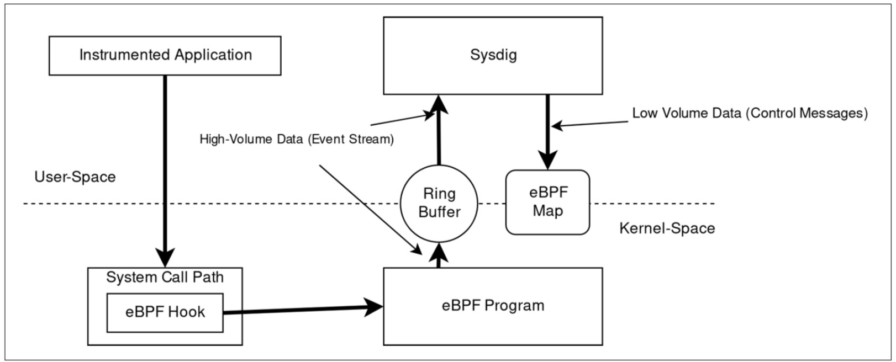
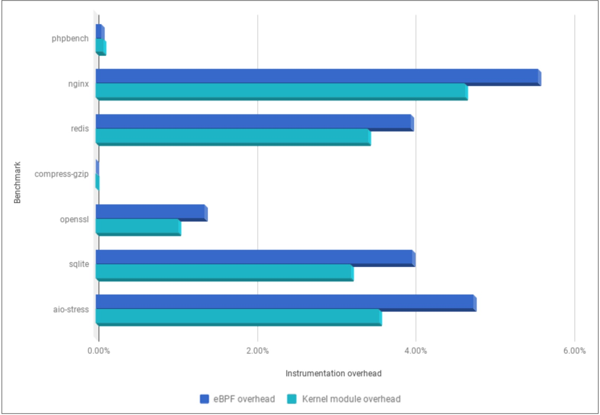

在实施一项新技术时，最要问自己的问题是：“这个技术有什么使用场景和案例？”这就是为什么我们决定采访一些最令人兴奋的BPF项目的创建者，以分享他们的想法。

### Sysdig eBPF的上帝模式

Sysdig是一家提供开源Linux故障排除工具的公司，于2017年开始在内核4.11下使用eBPF。

从历史上看，它一直使用内核模块来提取并完成所有内核方面的工作，但是随着用户数的增加以及越来越多的公司开始进行试验，该公司承认，对于大多数外部参与者而言，这是一个限制。很多种方法：

- 越来越多的用户无法在其计算机上加载内核模块。云原生平台对运行时程序可以做什么的限制越来越严格。

- 新的参与者（甚至是老参与者）都不了解内核模块的架构。这减少了贡献者的总数，并且是项目本身发展的限制因素。

- 内核模块的维护很困难，这不仅是因为编写代码，而且还因为需要付出一定的努力才能确保其安全和组织良好。

出于这些动机，Sysdig决定尝试使用编写模块中具有的相同功能集但使用eBPF程序的方法。自动采用eBPF的另一个好处是Sysdig可以进一步利用其他出色的eBPF追踪功能。例如，使用用户探针将eBPF程序附加到用户态应用程序中的特定执行点上相对容易，如第53页的“用户态探针”所述。

此外，该项目现在可以在eBPF程序中使用原生帮助功能来捕获正在运行的进程的堆栈跟踪，以增强典型的系统调用事件流。这为用户提供了更多的故障排除信息。

尽管事事如意，但是由于eBPF虚拟机启动时的局限性，Sysdig最初面临一些挑战，因此该项目的主要架构师Gianluca Borello决定通过向内核贡献上游补丁来改进它本身：

- 在eBPF程序中本地处理字符串的能力。
- 一系列的补丁可改善eBPF程序1、2和3中的参数定义。

后者对于处理系统调用参数特别重要，可能该工具中可用的最重要的数据源。

图9-1展示了Sysdig中EBPF模型的架构：

该实现的核心是负责该检测的自定义eBPF程序的集合。这些程序是用C编程语言的子集编写的。它们使用最新版本的Clang和LLVM进行编译，后者将高级C代码转换为eBPF字节码。

Sysdig会在每个不同的执行点为内核提供一个eBPF程序。当前，eBPF程序已附加到以下静态追踪点：

- 系统调用进入路径。

- 系统调用退出路径。

- 进程上下文切换。

- 进程终止。

- 次要和主要页故障。

- 进程信号传递。

每个程序都接收执行点数据（例如，对于系统调用，调用过程传递的参数）并开始处理它们。处理取决于系统调用的类型。对于简单的系统调用，仅将参数复制到用于临时存储的eBPF映射中，直到形成整个事件框架为止。对于其他更复杂的调用，eBPF程序包含用于转换或扩展参数的逻辑。这使Sysdig应用程序可以在用户空间中充分利用数据。

一些其他数据，包括：

- 与网络连接关联的数据（TCP / UDP IPv4 / IPv6元组，UNIX套接字名称等）
- 有关进程的高精度的度量（内存计数器，页面错误，套接字队列长度等）
- 特定于容器的数据，例如发出syscall的进程所属的cgroup，以及进程所在的命名空间。

如图9-1所示，在eBPF程序捕获了特定系统调用所需的所有数据之后，它使用特殊的原生BPF函数将数据推送到用户态应用程序可以以很高的吞吐量读取的一组CPU的环形缓冲区中。这就是在Sysdig中使用eBPF与使用eBPF映射共享内核态和用户态中生成的“小数据”的典型范例的地方。要了解有关映射以及如何在用户空间和内核空间之间进行通信的更多信息，请参阅第3章。

从性能的角度来看，效果不错！在图9-2中，您可以看到Sysdig的eBPF工具的开销仅略微大于“经典”内核模块的开销。

您可以按照用法说明使用Sysdig及其eBPF支持，但也请确保同时查看BPF驱动程序的代码。

### Flowmill

Flowmill是一家可观察性的初创公司，其创始人Jonathan Perry从一项名为Flowtune的学术研究项目中脱颖而出。 Flowtune研究了如何在拥塞的数据中心网络中有效地调度单个数据包。这项工作所需的核心技术之一是一种以极低的开销收集网络遥测的方法。 Flowmill最终采用了该技术来观察，聚合和分析分布式应用程序中每个组件之间的连接，以执行以下操作：

- 提供有关服务如何在分布式系统中交互的准确视图。

- 确定流量，错误或延迟在统计上发生了重大变化的区域。

Flowmill使用eBPF内核探针来跟踪每个打开的套接字并定期捕获系统指标。这很复杂，原因有很多：

- 建立eBPF探针时，有必要对新连接和现有连接进行检测。此外，它必须考虑通过内核的TCP和UDP以及IPv4和IPv6代码路径。

- 对于基于容器的系统，每个套接字都必须归于适当的cgroup，并与来自Kubernetes或Docker等平台的编排元数据结合在一起。

- 必须通过conntrack执行网络地址转换，以建立套接字与其外部可见IP地址之间的映射。例如，在Docker中，常见的网络模型使用源NAT来伪装主机IP地址后面和Kubernetes中的容器，而服务虚拟IP地址用于表示一组容器。

- 必须对eBPF程序收集的数据进行处理，以按服务提供汇总，并匹配在连接的两侧收集的数据。

但是，添加eBPF内核探针提供了一种更有效，更可靠的方式来收集此数据。它完全消除了丢失连接的风险，并且可以在亚秒级间隔内以较低的开销在每个套接字上完成操作。 Flowmill的方法依赖于代理，该代理将一组eBPF kprobes和用户空间指标收集以及现成的聚合和后处理结合在一起。该实现大量使用了Perf环，将每个套接字上收集的度量传递到用户空间以进行进一步处理。此外，它使用哈希映射来追踪打开的TCP和UDP套接字。

Flowmill发现设计eBPF检测通常有两种策略。 “简便”方法找到在每个检测事件上都会调用的一到两个内核函数，但需要BPF代码在非常频繁地调用的检测点上维护更多状态并在每次调用中执行更多工作。为了减轻检测程序对生产环境工作负载的影响，Flowmill采取了另一种策略：检测那些比较重要但是调用次数不是那么频繁的事件。这样可以显著降低开销，但是需要花费更多的精力来覆盖所有重要的代码路径，尤其是随着内核代码的发展跨内核版本。

例如，`tcp_v4_do_rcv` 捕获所有已建立的TCP RX流量并可以访问`struct sock`，但是调用量非常大。取而代之的是，用户可以检测与ACK，乱序包处理，RTT估计等功能有关的功能，这些功能允许处理影响已知指标的特定事件。

通过跨TCP，UDP，进程，容器，conntrack和其他子系统的这种方法，系统以极低的开销实现了系统的极佳性能，而这在大多数系统中都很难测量。包括eBPF和用户空间组件在内的每个内核的CPU开销通常为0.1％到0.25％，并且主要取决于创建新套接字的速率。

您可以在其网站上了解有关Flowmill和Flowtune的更多信息。

Sysdig和Flowmill是使用BPF来构建监视和可观察性工具的先驱，但并不是唯一的工具。在整本书中，我们都提到了Cillium和Facebook等其他公司，它们已经选择BPF作为其框架来提供高度安全和高性能的网络基础架构。对于BPF及其社区的未来，我们感到非常兴奋，我们迫不及待地想看看您用它构建了什么。